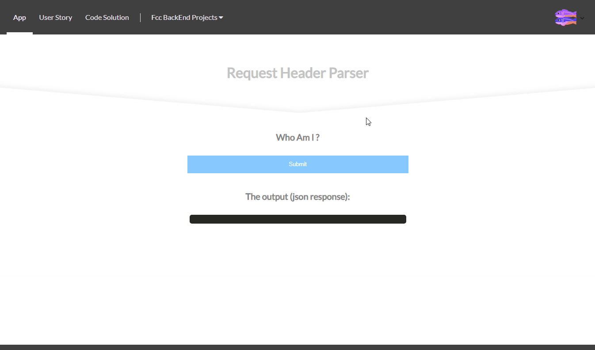

#API Project: Request Header Parser Microservice for freeCodeCamp
### About the project

it's a freecodecamp project in the "Apis and Microservices Projects" module, you have to build an API that will return a json response containing your IP address, preferred language and system infos.

bonus*: 
- Front-end using React

### Tools used

**Front-end:** React

**Back-end:** Express

### Screenshot

### Link

https://fcc-bt-request-header-parser.glitch.me

### User stories

1. I can get the IP address, preferred languages (from header `Accept-Language`) and system infos (from header `User-Agent`) for my device.